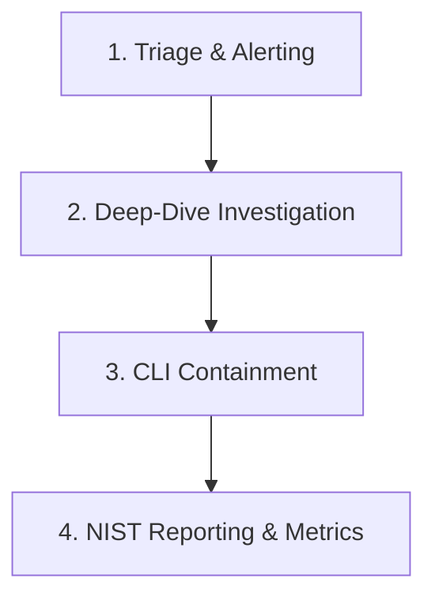

# SIREN SOC Dashboard — Analyst User Manual

Welcome to the **SIREN (Security Incident Response & Event Network) SOC Dashboard**. This guide explains the core features, detection engine, analyst workflows, and deployment procedures for the SIREN SOC Mini-Hackathon submission.

---

## 1. System Overview
SIREN is a beginner-friendly Security Operations Center simulation designed to demonstrate the complete lifecycle of a security event—from raw log management to detection correlation, analyst investigation, incident containment, and NIST-aligned report generation.

All event calculations are performed client-side in real-time, providing an offline-friendly, zero-infrastructure demo.

---

## 2. SIEM & Detection Engine Architecture

The detection engine parses raw security events into three main threat categories:

### A. SSH Brute Force (MITRE ATT&CK: T1110)
- **Correlation Rule**: Triggers when $\ge 5$ failed SSH authentication attempts are detected from the same IP address and target user within a **2-minute** window.
- **Risk Scoring**: $Likelihood \times Impact = Risk\ Score$ (Scale of 1–25).
  - **Base Likelihood**: Based on attempt volume: $5\text{–}9 \rightarrow 3$, $10\text{–}20 \rightarrow 4$, $> 20 \rightarrow 5$.
  - **Proactive Time-of-Day Anomaly Check**: If the brute force starts during off-hours (before 8 AM or after 8 PM), the Likelihood score is increased by **+1** (maximum of 5) and flagged.
  - **Account Sensitivity (Impact)**: Target user accounts named `root` or `admin` receive an Impact rating of **5** (highest sensitivity). Regular user accounts receive an Impact rating of **3**.
- **Critical Escalation (Compromise)**: If a successful login event (`Accepted password`) is detected from the same IP and user inside the same 2-minute bucket *after* the brute force starts, the system automatically escalates the severity to **Critical** (indicating a successful compromise).

### B. Port Scan (MITRE ATT&CK: T1046)
- **Correlation Rule**: Triggers when $\ge 5$ distinct destination ports are contacted by a single source IP within a **1-minute** window.
- **Risk Scoring**: $Likelihood \times Impact = Risk\ Score$.
  - **Likelihood**: $\le 6\text{ ports} \rightarrow 3$, $\le 10\text{ ports} \rightarrow 4$, $> 10\text{ ports} \rightarrow 5$.
  - **Impact**: Defaulted to **3**.

### C. Impossible Login Burst (MITRE ATT&CK: T1078)
- **Correlation Rule**: Triggers when $\ge 3$ successful SSH logins are detected from the same IP address targeting multiple users within a **1-minute** window.
- **Severity**: Automatically marked **Critical** with a Risk Score of **25** (Likelihood 5, Impact 5).

---

## 3. Analyst Incident Response Workflow

The SIREN dashboard supports an interactive 4-stage workflow following the **NIST Incident Response Lifecycle**:



### Step 1: Alert Triage
- Review the top summary cards (**Critical**, **High**, and **Medium** alert counts).
- Scan the **Active Incidents** list. Incidents are sorted automatically by Risk Score (descending) so the highest threats are visible first.

### Step 2: Deep-Dive Investigation
- Click **Investigate** on any incident card to load the **Investigation Console**.
- Review the incident metadata (ID, Source IP, Target User, and Time to Detect).
- Scroll through the **Attack Event Timeline**, which aggregates only the logs related to that incident chronologically to trace the attacker's trajectory.

### Step 3: Command-Line Containment
- Click **Contain IP** to block the source IP address.
- Confirm the action in the prompt.
- The **Incident Containment & Response Log** terminal at the bottom will display the simulated command execution of the `incident_response.sh` script, showing the firewall block action:
  ```bash
  sudo iptables -A INPUT -s "<attacker_ip>" -j DROP
  ```
- The incident status badge will update from **ACTIVE** (red) to **CONTAINED** (green).

### Step 4: Report Exporting & Metrics
- Once contained, a **Download NIST Incident Report** button appears in the Investigation Console.
- Click it to download a `.txt` file containing the formal incident documentation (ID, timestamps, evidence list, mitigation action, and final status).
- Notice the **MTTD** (Mean Time to Detect) and **MTTR** (Mean Time to Respond) average counters update at the top of the dashboard.

---

## 4. Scenario Simulations

You can demonstrate the detection engine to judges using the dropdown menu:

1. **Scenario 1: SSH Brute Force (Standard)**
   - Injects 5 failed SSH attempts targeting `webuser` from `10.10.40.12` during normal hours.
   - *Result*: Medium/High Alert (Risk Score 9).
2. **Scenario 2: SSH Brute Force (Escalation / Success)**
   - Injects 5 failed attempts targeting `testuser` from `10.10.30.22`, followed by a successful login.
   - *Result*: Critical Alert (compromise confirmed).
3. **Scenario 3: SSH Brute Force (Off-Hours & Root)**
   - Injects 5 failed attempts targeting `root` from `10.10.90.11` at 3:40 AM.
   - *Result*: Critical Alert (Risk Score 20 due to root target and off-hours bump).
4. **Scenario 4: Port Scan (Firewall Activity)**
   - Injects connections targeting 6 unique ports from `10.10.50.88`.
   - *Result*: Medium Alert (Risk Score 9).
5. **Scenario 5: Impossible Login Burst**
   - Injects 3 successful logins targeting different administrators in 15 seconds.
   - *Result*: Critical Alert (Risk Score 25).

---

## 5. Deployment Guide (GitHub Pages)

To host your dashboard online on GitHub Pages:

### Step 1: Initialize Git
Open PowerShell or Git Bash inside the project directory (`SIREN_SOC_Demo`) and run:
```bash
git init
git add .
git commit -m "Initial commit of SIREN SOC Dashboard v2"
```

### Step 2: Push to GitHub
1. Create a new public repository on GitHub named `siren-soc-demo` (leave it empty, without README or gitignore).
2. Link your local files and push them:
```bash
git branch -M main
git remote add origin https://github.com/YOUR_GITHUB_USERNAME/siren-soc-demo.git
git push -u origin main
```

### Step 3: Turn on GitHub Pages
1. Go to your repository page on GitHub.
2. Click **Settings** (gear icon) at the top.
3. On the left sidebar, click **Pages**.
4. Under **Build and deployment**, change the Source dropdown to **Deploy from a branch**.
5. Under Branch, select **main** and `/ (root)`, then click **Save**.
6. GitHub will build the site within 1–2 minutes. Refresh the page to see your live URL (e.g., `https://YOUR_GITHUB_USERNAME.github.io/siren-soc-demo/`).
